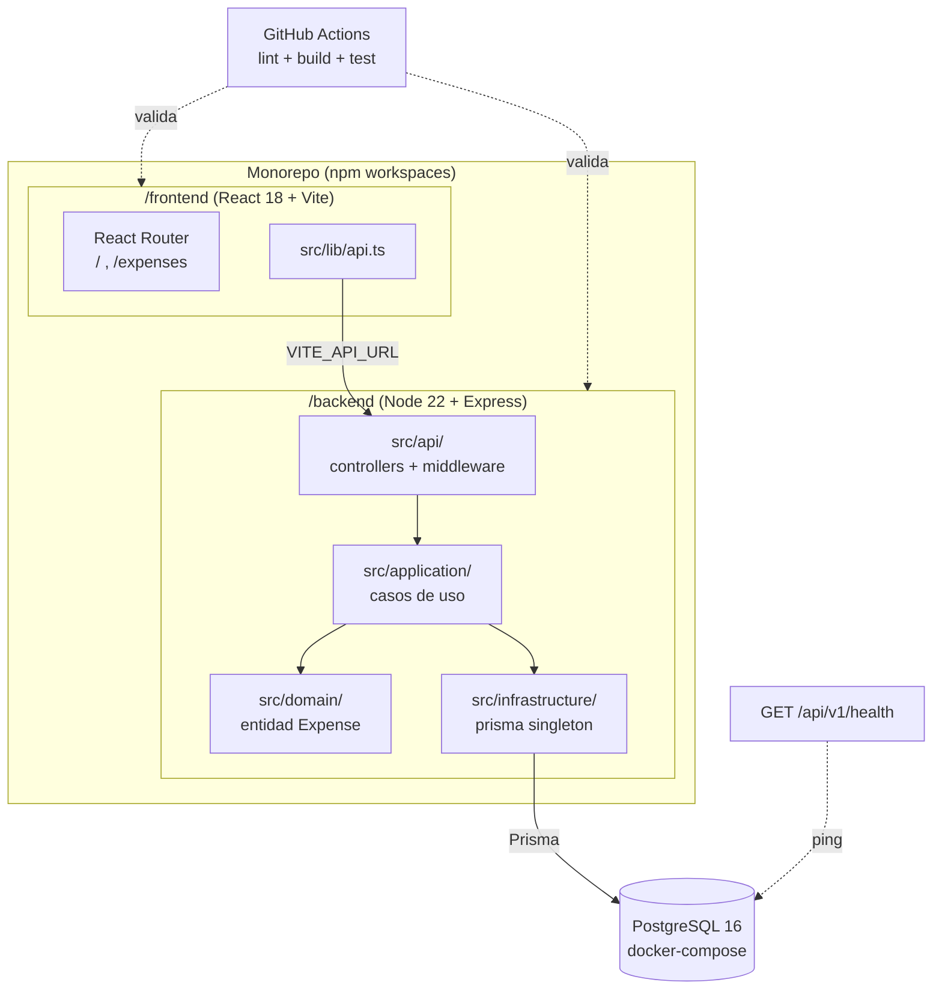

## Context

Expense Tracker arranca sin base técnica. El PBI-01 (#2) entrega el esqueleto sobre el que se construyen los 8 PBIs restantes del MVP (#3–#10). Las decisiones que se tomen aquí —estructura del repo, modelo de datos, contrato del health, fuente de la versión— se propagan a todas las features posteriores, por lo que el bootstrap debe cerrarlas explícitamente y minimizar lo que aún no se ejercita.

El stack está fijado por el contexto del proyecto: Node 22 + Express 4 + TypeScript estricto + Prisma 5 + PostgreSQL 16 en backend; React 18 + Vite 5 en frontend; Vitest para tests; docker-compose solo para la base de datos; GitHub Actions para CI.



## Goals / Non-Goals

**Goals:**
- Entorno local reproducible: de `git clone` a backend+frontend+DB corriendo siguiendo el README.
- Modelo de dominio `Expense` persistido con migración inicial y seed que cumple un contrato de distribución verificable.
- Endpoint de salud con contrato de respuesta cerrado y semántica HTTP correcta (200/503).
- Shell de frontend navegable con versión inyectada desde fuente única.
- CI que falla ante cualquier fallo de lint, build o test.
- Dejar montados los patrones transversales (capas, error middleware, arnés de testing) sin sobre-construir.

**Non-Goals:**
- Autenticación / usuarios reales (autor simulado con `MOCK_AUTHOR`).
- Endpoints de negocio (los aportan #3–#10).
- Validación Zod de payloads (se introduce en #3 con el primer DTO real).
- Dockerización de backend/frontend (solo la DB en contenedor).
- Umbral de coverage o tests exhaustivos.

## Decisions

### D-01: Monorepo con npm workspaces

**Decision:** Un solo repositorio con `npm workspaces` y dos paquetes (`/backend`, `/frontend`), un `package.json` raíz que orquesta los scripts.

**Rationale:** Un único `npm install`, un único pipeline de CI y un solo `docker-compose`. Minimiza la fricción de setup, que es el objetivo literal del PBI. Versionado atómico entre backend y frontend durante el MVP.

**Alternatives Considered:**
- *Repos separados / carpetas hermanas sin workspaces:* duplica instalación y CI, complica el versionado compartido.
- *Turborepo / Nx:* potencia innecesaria para 2 paquetes; añade complejidad de tooling.

**Trade-offs:** Acopla los ciclos de release de backend y frontend. Aceptable en un MVP de un solo equipo.

### D-02: `amount` como entero en céntimos + `currency` enum

**Decision:** El monto se almacena como entero en céntimos (`amount: Int`); la moneda es un enum (`Currency { EUR, USD }`, default `EUR`).

**Rationale:** Evita errores de redondeo en los totales (#8) y el desglose (#9). Modelar la moneda explícitamente ahora cuesta un campo; retrofitearla después cuesta una migración más refactor en 5 PBIs que ya leen el dato.

**Alternatives Considered:**
- *`Decimal` de Prisma:* correcto para dinero, pero arrastra la complejidad de `Decimal.js` en toda la cadena JS/JSON; céntimos enteros son más simples y suficientes.
- *`Float`:* descartado — errores de redondeo inaceptables en dinero.
- *EUR implícito sin campo currency:* bloquea cualquier soporte multi-moneda y obliga a migración futura.

**Trade-offs:** La capa de presentación debe formatear céntimos → unidades monetarias. Trivial y centralizable.

### D-03: Contrato cerrado del endpoint de salud

**Decision:** `GET /api/v1/health` devuelve un shape fijo, con `200` si la DB responde y `503` si no.

```typescript
// Response body (200 OK | 503 Service Unavailable)
interface HealthResponse {
  status: "ok" | "degraded";
  version: string;        // del package.json raíz
  uptime: number;         // segundos (process.uptime())
  checks: {
    database: {
      status: "up" | "down";
      latencyMs: number;  // duración del ping a Prisma
    };
  };
}
```

```jsonc
// Ejemplo 200 OK
{ "status": "ok", "version": "0.1.0", "uptime": 123.45,
  "checks": { "database": { "status": "up", "latencyMs": 12 } } }
// Ejemplo 503 (DB caída)
{ "status": "degraded", "version": "0.1.0", "uptime": 5.0,
  "checks": { "database": { "status": "down", "latencyMs": 0 } } }
```

**Rationale:** Un contrato cerrado evita que dos implementaciones válidas sean incompatibles. El `503` con DB caída permite que orquestadores/health checks externos reaccionen correctamente. El ping a la DB es un `SELECT 1` vía Prisma.

**Alternatives Considered:**
- *Body libre `{ status: "ok" }`:* ambiguo, no verificable, no distingue DB caída.
- *Siempre 200 con flag interno:* rompe la semántica HTTP esperada por health probes.

**Trade-offs:** Medir `latencyMs` añade una lectura de reloj por request. Coste despreciable.

### D-04: Versión desde el `package.json` raíz vía `VITE_APP_VERSION`

**Decision:** La versión es la del `package.json` raíz. El backend la lee en runtime; el frontend la recibe en build via `VITE_APP_VERSION` (definida en `vite.config` a partir del package raíz).

**Rationale:** Fuente única de verdad. Coherente con el patrón de env del frontend (`VITE_API_URL`). Evita versiones divergentes entre health y UI.

**Alternatives Considered:**
- *Versión hardcodeada por paquete:* divergencia garantizada con el tiempo.
- *Endpoint que el frontend consulta para la versión:* acopla el render de bienvenida a una llamada de red innecesaria.

**Trade-offs:** La versión del frontend se congela en build-time; aceptable porque se rebuildea en cada deploy.

### D-05: Seed manual con contrato de distribución

**Decision:** El seed se ejecuta manualmente con `npm run seed`, separado de `npm run migrate`, y garantiza una distribución mínima (≥15 gastos, todas las categorías, todos los estados, ≥5 aprobados).

**Rationale:** Desacopla migración de datos de ejemplo; evita sembrar en cada run de CI/tests. El contrato de distribución convierte "al menos 15 gastos" en algo sobre lo que los PBIs siguientes pueden construir tests con confianza (#4 filtro, #5/#6 aprobar/rechazar, #8/#9 totales).

**Alternatives Considered:**
- *Seed automático tras `migrate`:* acopla responsabilidades y contamina entornos de test.
- *Seed sin contrato ("unos cuantos gastos"):* tests downstream frágiles por datos insuficientes.

**Trade-offs:** Un paso manual más en el arranque. Mitigado documentándolo explícitamente en el README.

### D-06: Error middleware sí, Zod no (todavía)

**Decision:** Montar el middleware centralizado de errores de Express en el bootstrap, pero **no** la validación Zod de payloads (se difiere a #3).

**Rationale:** El error middleware es transversal —incluso un 500 en `/health` debe formatearse con el shape `{ error, details? }`—, así que pertenece al bootstrap. Zod en controladores solo tiene sentido con un payload de entrada real, y el health no recibe body. Montarlo aquí sería infraestructura muerta, en tensión con el principio de "lo mínimo".

**Alternatives Considered:**
- *Montar Zod ya, validando algo trivial:* infraestructura sin uso real.
- *Diferir también el error middleware:* dejaría el health sin formato de error consistente.

**Trade-offs:** #3 hereda la tarea de introducir el patrón Zod. Documentado explícitamente como fuera de alcance aquí.

### D-07: `author` como string simulado

**Decision:** `author` es un `string` (email). En el MVP se inyecta una constante `MOCK_AUTHOR` en la capa de aplicación; no llega desde el cliente.

**Rationale:** Auth está fuera de alcance, pero el campo debe existir para no bloquear #2/#4/#5. Un string simulado mantiene el modelo usable sin arrastrar gestión de usuarios.

**Alternatives Considered:**
- *FK a tabla `User`:* introduce autenticación/usuarios, fuera de alcance.
- *Omitir el campo:* obligaría a una migración cuando #3 cree gastos con autor.

**Trade-offs:** Hay que reemplazar `MOCK_AUTHOR` cuando llegue auth real. Aislado en un único punto de la capa de aplicación.

## Risks / Trade-offs

- **[Drift entre el contrato del health y su implementación]** → El test de integración del health valida el shape exacto (claves `status`, `version`, `uptime`, `checks.database`), no solo el `200`.
- **[Seed que no cumple el contrato de distribución y rompe tests downstream]** → Un test del seed verifica las invariantes (conteo ≥15, todas las categorías, ≥3 por estado, ≥5 aprobados) antes de que los PBIs siguientes dependan de ellas.
- **[`amount` en céntimos mal formateado en presentación]** → Centralizar el formateo en una utilidad única desde el inicio; documentarlo como convención.
- **[CI verde local pero rojo en Actions por diferencias de entorno]** → El job de CI levanta PostgreSQL como service container espejando el `docker-compose` local; misma versión de Node (22) fijada en el workflow.
- **[`VITE_APP_VERSION` ausente en build rompe la bienvenida]** → La página degrada con un valor por defecto en lugar de fallar (cubierto por escenario de spec).
- **[Sobre-ingeniería del bootstrap]** → Non-goals explícitos y D-06 acotan el alcance; lo no ejercitado se difiere a los PBIs que lo usan.

## Migration Plan

Es la inicialización del proyecto; no hay estado previo que migrar.

1. Crear estructura de monorepo y `package.json` raíz con workspaces.
2. Backend: estructura por capas, Prisma schema + enums, migración inicial, cliente singleton, health endpoint, error middleware, seed.
3. Frontend: scaffold Vite + React Router + bienvenida + cliente HTTP.
4. Infra: `docker-compose.yml`, `.env.example`, scripts npm, README.
5. CI: workflow de GitHub Actions con service container de PostgreSQL.
6. Tests mínimos: integración del health (backend), render de bienvenida (frontend).

**Rollback:** al ser bootstrap, el rollback es revertir el PR completo; no hay datos productivos.

## Open Questions

- ¿`Currency` debe incluir más monedas que `EUR`/`USD` desde el inicio, o se amplía cuando un PBI lo requiera? (Propuesta: empezar con ambas, ampliar bajo demanda.)
- ¿El service container de PostgreSQL en CI debe usar exactamente la misma imagen `postgres:16` que docker-compose? (Propuesta: sí, para paridad.)
- ¿Conviene fijar las versiones exactas de dependencias (lockfile commiteado) ya en el bootstrap? (Propuesta: sí, commitear `package-lock.json`.)
