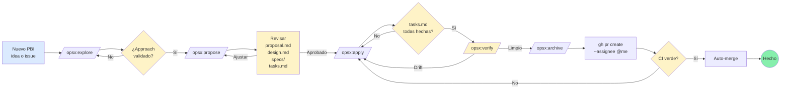
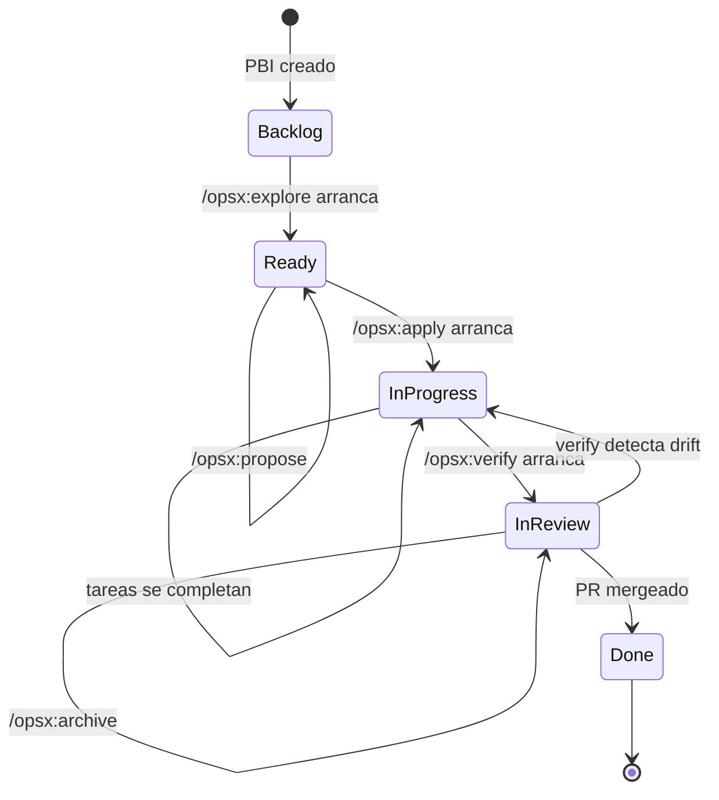
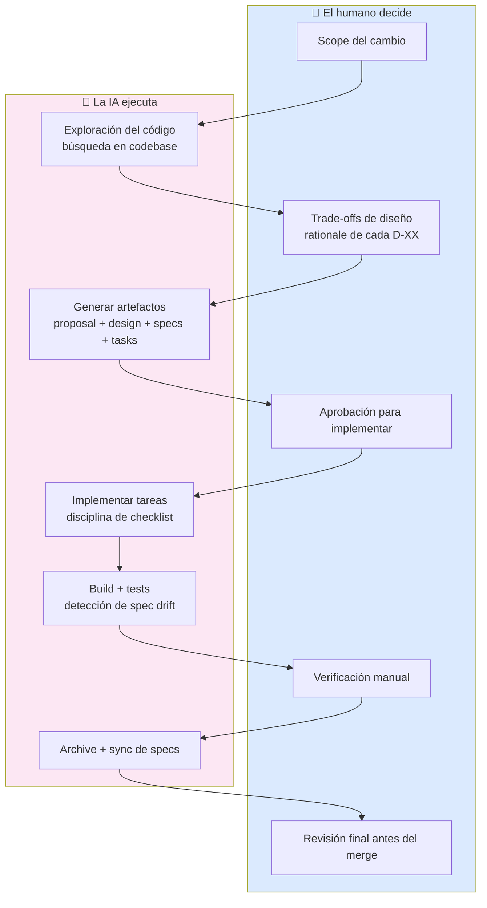
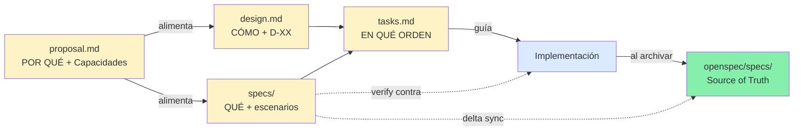

# Diagramas Mermaid del proceso SDD

Copia y pega cualquiera de estos en tus slides, tu documentación, o tu README. GitHub, GitLab, Notion, Obsidian y la mayoría de renderers de markdown modernos los renderizan nativamente.

## 1. Flujo completo SDD

## 2. Transiciones del project board

## 3. Quién decide qué — humano vs IA

## 4. Artefactos como contrato

